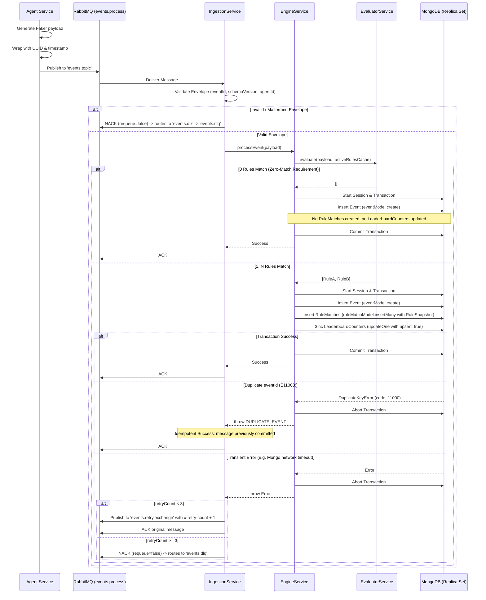
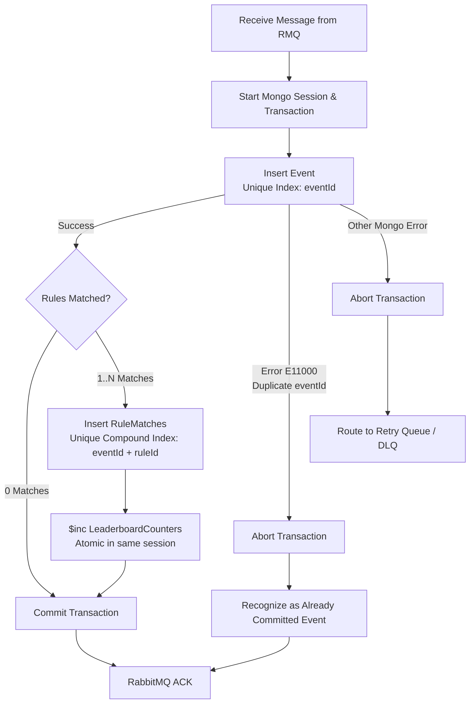
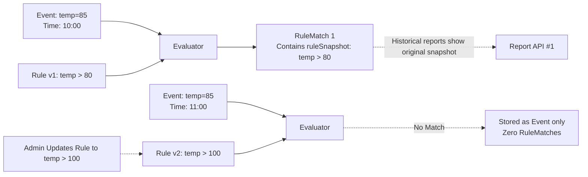
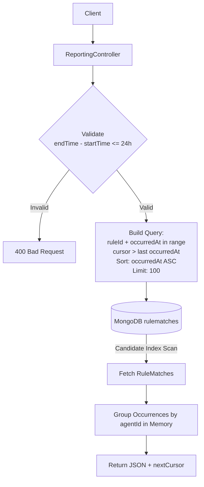
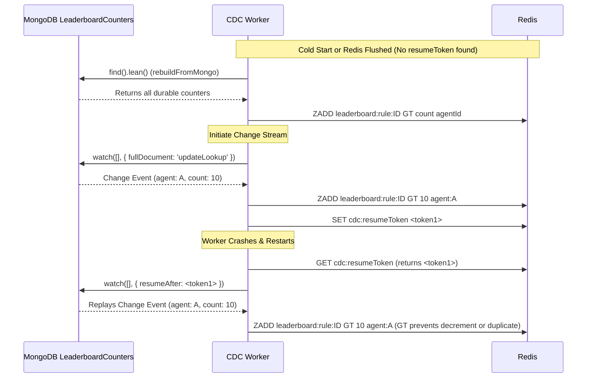
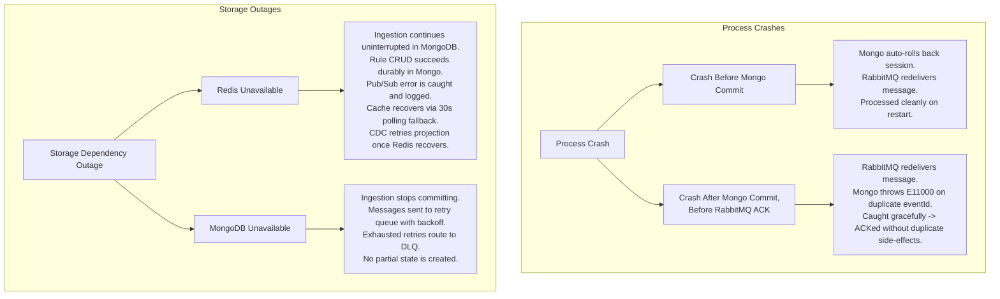
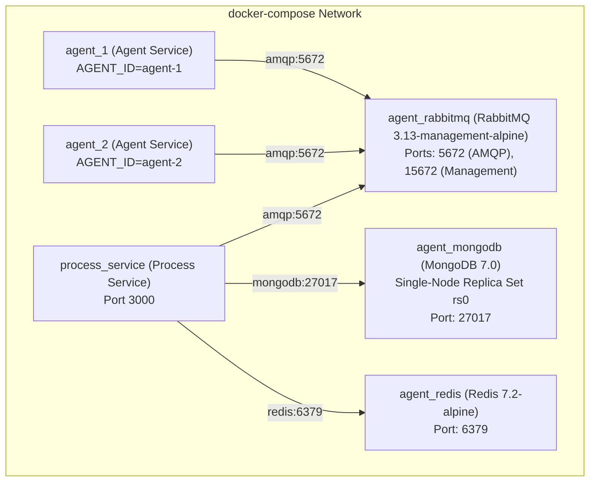
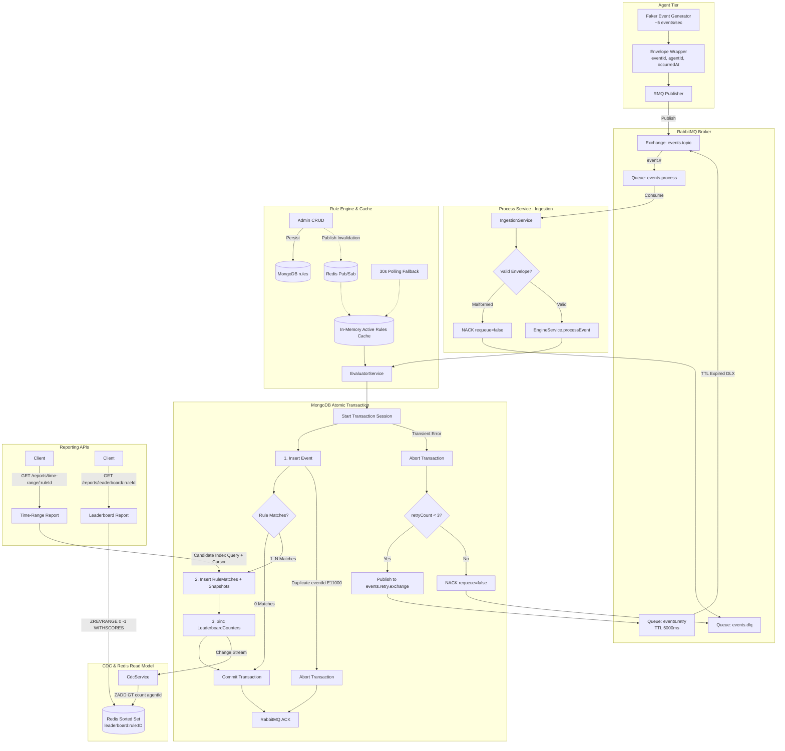

# Architecture & Execution Flow

This document provides a comprehensive, diagram-backed explanation of the implemented `agent-process-event-system`. It is designed to help engineers understand the system's runtime behavior, boundaries, and persistence mechanisms based on the actual source code.

---

## 1. System Overview

This project simulates a high-throughput sensor network evaluating incoming events against dynamic rules.
- **Agent Service**: Generates continuous synthetic event streams (`~5 events/sec` using Faker) and publishes them to RabbitMQ. It has no local database and is stateless.
- **RabbitMQ**: Message broker providing at-least-once delivery, decoupling Agents from Processors, and providing durable queues with delayed retry (`events.retry`) and dead-letter (`events.dlq`) topologies.
- **Process Service**: Consumes messages from RabbitMQ, evaluates them against in-memory cached rules, and manages transactions.
- **MongoDB**: The durable, strictly consistent **Source of Truth**. It persists Events, RuleMatches, and internal LeaderboardCounters inside atomic Multi-Document Transactions.
- **Redis**: A fast, **rebuildable Read Model** used for real-time Leaderboard projection (via Sorted Sets) and Pub/Sub notifications for rule invalidation.

```mermaid
flowchart TD
    subgraph Agent Tier
    A1[Agent 1]
    A2[Agent 2]
    end

    subgraph Messaging
    RMQ[RabbitMQ\n'events.topic']
    RetryQ[RabbitMQ Retry Queue\n'events.retry' TTL=5s]
    DLQ[RabbitMQ DLQ\n'events.dlq']
    end

    subgraph Process Service
    Consumer[RabbitMQ Consumer\nIngestionService]
    RuleEngine[Rule Engine\nIn-Memory Cache]
    CDC[CDC Worker\nCdcService]
    API[Reporting APIs\nReportingService]
    end

    subgraph Storage Tier
    Mongo[(MongoDB\nSource of Truth)]
    Redis[(Redis\nRebuildable Read Model & Pub/Sub)]
    end

    A1 -->|Publish Event| RMQ
    A2 -->|Publish Event| RMQ

    RMQ -->|Consume| Consumer
    Consumer -->|Evaluate| RuleEngine
    Consumer -->|Atomic Transaction| Mongo
    Consumer -.->|Transient Failure (attempts < 3)| RetryQ
    RetryQ -.->|TTL 5s Expired (DLX)| RMQ
    Consumer -.->|Malformed or Attempts >= 3| DLQ

    Mongo -- Change Stream --> CDC
    CDC -->|ZADD GT| Redis
    CDC -.->|Cold Start / Redis Reconnect Rebuild| Mongo

    API -->|Read Time-Range| Mongo
    API -->|Read Leaderboard| Redis

    Mongo -. Pub/Sub Invalidation .-> Redis
    Redis -. Notify Invalidated .-> RuleEngine
```

---

## 2. Project Structure

The codebase is organized as a NestJS monorepo containing two distinct applications:

```text
├── apps/
│   ├── agent-service/          # Lightweight event generator
│   │   ├── src/
│   │   │   ├── generator/      # Faker-based event generation logic (5 events/sec)
│   │   │   ├── publisher/      # RabbitMQ AMQP publishing logic with reconnection
│   │   │   ├── agent-service.module.ts
│   │   │   ├── agent-service.service.ts
│   │   │   └── main.ts
│   │   └── Dockerfile
│   └── process-service/        # Core processing monolith
│       ├── src/
│       │   ├── core/           # Cross-cutting concerns (Pino Logging)
│       │   │   └── logging/
│       │   ├── infrastructure/ # DB/Broker Adapters
│       │   │   ├── cache/      # Redis connection module (REDIS_CLIENT, REDIS_SUBSCRIBER)
│       │   │   ├── database/   # Mongoose Schemas (Event, Rule, RuleMatch, LeaderboardCounter)
│       │   │   └── messaging/  # amqplib topology setup (Exchanges, Queues, Retry, DLQ)
│       │   ├── modules/
│       │   │   ├── cdc/        # MongoDB Change Stream worker projecting to Redis with rebuild recovery
│       │   │   ├── engine/     # Rule Evaluator and MongoDB Transaction coordinator
│       │   │   ├── health/     # Terminus healthcheck endpoints
│       │   │   ├── ingestion/  # RMQ Consumer, bounded retry & DLQ handling
│       │   │   ├── reporting/  # REST APIs (Time-Range Cursor Pagination, Leaderboard ZREVRANGE)
│       │   │   └── rules/      # Rule CRUD & Redis Pub/Sub invalidation with polling fallback
│       │   ├── app.module.ts
│       │   └── main.ts
│       ├── test/
│       │   └── app.e2e-spec.ts # End-to-end tests (Zero-match, Multi-match, Idempotency, DLQ)
│       └── Dockerfile
├── scripts/
│   └── verify-index.ts         # Verifies candidate index performance via explain("executionStats")
└── docker-compose.yml          # Local infra definition (Mongo Replica Set, Redis, RMQ)
```

---

## 3. Complete Event Lifecycle

The following sequence diagram details the complete journey of a single event from generation to persistence and RabbitMQ acknowledgment.



---

## 4. RabbitMQ Flow

The `MessagingModule` and `IngestionService` implement a bounded retry topology with a dead-letter exchange (DLX) and delayed retry queue. **No unbounded `NACK(requeue=true)` infinite poison loops exist.**

### Topology Configuration
- **Main Exchange**: `events.topic` (type: `topic`, durable: `true`)
- **Main Queue**: `events.process` (durable: `true`)
  - Bound to `events.topic` on `event.#`
  - Dead Letter Exchange: `events.dlx` with routing key `dlq.routing.key`
- **Delayed Retry Exchange**: `events.retry.exchange` (type: `direct`, durable: `true`)
- **Delayed Retry Queue**: `events.retry` (durable: `true`)
  - Bound to `events.retry.exchange` on `retry`
  - `messageTtl`: 5000ms (5 seconds backoff delay)
  - `deadLetterExchange`: `events.topic`
  - `deadLetterRoutingKey`: `event.process.retry` (caught by `event.#` binding on `events.process`)
- **Dead Letter Exchange (DLX)**: `events.dlx` (type: `direct`, durable: `true`)
- **Dead Letter Queue (DLQ)**: `events.dlq` (durable: `true`)
  - Bound to `events.dlx` on `dlq.routing.key`

```mermaid
flowchart TD
    Pub[Agent Publisher] -->|'event.sensor'| Topic[Exchange: 'events.topic']
    Topic -->|'event.#'| MainQ[Queue: 'events.process']
    
    MainQ -->|Consume| Worker[IngestionService Consumer]
    
    Worker -->|Success or Duplicate| Ack[ACK: Message Removed]
    
    Worker -->|Malformed Event\nInvalid Schema| NackMalformed[NACK requeue=false]
    NackMalformed --> DLX[Exchange: 'events.dlx']
    
    Worker -->|Transient Error| CheckRetries{retryCount < 3?}
    CheckRetries -->|Yes| PublishRetry[Publish to 'events.retry.exchange'\nHeader: x-retry-count + 1\nACK original message]
    PublishRetry --> RetryQ[Queue: 'events.retry'\nTTL: 5000ms]
    RetryQ -->|TTL Expires (Dead Letter)| Topic
    
    CheckRetries -->|No (Exhausted)| NackExhausted[NACK requeue=false]
    NackExhausted --> DLX
    
    DLX -->|'dlq.routing.key'| DLQ[Queue: 'events.dlq']
```

---

## 5. MongoDB Transaction & Idempotency

Idempotency is guaranteed by ensuring that the `Event` insertion, all corresponding `RuleMatches`, and all `LeaderboardCounters` increments occur within the **exact same atomic session/transaction**.

If a crash occurs *after* MongoDB commits but *before* RabbitMQ receives the ACK, RabbitMQ will redeliver the message. The unique index on `eventId` triggers an `E11000 Duplicate Key Error` upon the second insert. The application recognizes that the entire transaction already committed, aborts the redundant session, and ACKs the redelivered message.



> [!IMPORTANT]
> This pattern is safe ONLY because `Event`, `RuleMatches`, and `LeaderboardCounters` are written atomically. If they were written across separate operations, a crash between operations would leave partial state and cause silent data corruption upon duplicate ACK.

---

## 6. Rule Engine Flow

Rules are stored durably in MongoDB. To process high-volume events without per-event database queries, the `EngineService` maintains an in-memory active rules cache.

- When a rule is Created, Updated, or Deleted via REST API, the mutation is committed to MongoDB first.
- An invalidation timestamp is published to Redis channel `rules:invalidated`.
- All running Process Service instances listen to this channel and asynchronously refresh their cache.
- A **30-second polling fallback** runs continuously to recover from missed Pub/Sub notifications during network partitions or Redis restarts.

```mermaid
flowchart TD
    subgraph Rule Management (REST)
    Admin[Admin] -->|POST / PUT / DELETE| API[Rules Controller]
    API -->|1. Persist Mutation| MongoRule[(MongoDB Rules\nSource of Truth)]
    API -->|2. Publish 'rules:invalidated'| RedisPub[(Redis Pub/Sub)]
    end

    subgraph Process Service Local Cache
    RedisPub -.->|Subscribe 'rules:invalidated'| Listener[Invalidation Listener]
    Fallback[30s Polling Fallback Interval] -.-> Listener
    Listener -->|Fetch Active Rules| MongoRule
    Listener -->|Update| Cache[Active Rules Cache]
    end

    subgraph In-Memory Evaluation
    Event[Incoming Event] --> Eval[EvaluatorService]
    Cache --> Eval
    Eval -->|GT / LT / EQ evaluation| Result[Matched Rules Array]
    end
```

---

## 7. Historical Rule Correctness

When a rule matches an event, a deep snapshot (`JSON.parse(JSON.stringify(rule))`) of the exact rule definition is stored directly inside the `RuleMatch` document.

If an administrator later modifies or deletes that rule, historical reporting queries continue to reflect the exact conditions under which the match originally occurred.



---

## 8. Report API #1 Flow (Time Range)

The Time-Range endpoint (`GET /reports/time-range/:ruleId`) retrieves occurrences from MongoDB within a maximum 24-hour window, paginated via a time-based cursor (`occurredAt`).

### Candidate Index Verification
The schema defines a candidate compound index:
```javascript
{ ruleId: 1, occurredAt: 1, agentId: 1 }
```
- **Verification Tool**: `scripts/verify-index.ts` runs `explain("executionStats")` on this exact query with projection `{ agentId: 1, occurredAt: 1, _id: 0 }`.
- **Purpose**: Verifies whether MongoDB performs an index scan (`IXSCAN`) and whether the projection allows a fully index-covered scan (`totalDocsExamined: 0`).
- *Note: This index is a candidate whose actual execution statistics should be verified under real data distributions using the verification script.*



---

## 9. Report API #2 / Leaderboard Flow

The system maintains a clean separation between the synchronous, durable write path (MongoDB) and the asynchronous, high-speed read path (Redis).

```mermaid
flowchart LR
    subgraph Write Path (Synchronous & Durable)
    RM[RuleMatch Logic] -->|Multi-Doc Transaction| LC[(MongoDB LeaderboardCounters\nSource of Truth)]
    end

    subgraph Projection Path (Asynchronous CDC)
    LC -- Change Stream --> CDC[CDC Worker\nCdcService]
    CDC -->|ZADD leaderboard:rule:ID GT count agentId| Redis[(Redis Sorted Set\nRead Model)]
    end

    subgraph Read Path (Synchronous & Fast)
    Client[Client] --> API[ReportingController /leaderboard/:ruleId]
    API -->|ZREVRANGE 0 -1 WITHSCORES| Redis
    API --> Client
    end
```

---

## 10. CDC Failure, Recovery & Resumability

The `CdcService` listens to MongoDB Change Streams on `LeaderboardCounters`.

### Delivery Semantics & Idempotent Projection
- **Change Stream Guarantee**: At-least-once, resumable stream. The `resumeToken` provides **resumability**, NOT exactly-once execution. If the worker restarts, replayed events may be redelivered.
- **Redis Projection Guarantee**: Idempotent and effectively-once via Redis `ZADD ... GT`. The `GT` (Greater Than) flag ensures that an out-of-order or replayed change event containing an older count will never overwrite a higher count already in Redis.

### Cold Start & Redis Recovery
If Redis is flushed, restarted, or if `resumeToken` is missing:
1. `CdcService` executes `rebuildFromMongo()`, reading all durable `LeaderboardCounters` from MongoDB and setting them into Redis via `ZADD ... GT`.
2. It then initiates the Change Stream watch. Even if new events arrive during rebuild, `ZADD ... GT` guarantees monotonic score progression.



---

## 11. Failure Scenarios



---

## 12. Docker Architecture

The actual `docker-compose.yml` topography configures the multi-container environment.



---

## 13. Testing Flow

The test suite covers unit and end-to-end integration flows:

### Unit Tests
- **`evaluator.service.spec.ts`**: Pure unit tests covering `GT`, `LT`, `EQ` operator logic, multi-rule evaluation, zero-match evaluations, and missing payload fields.

### End-to-End Tests
- **`apps/process-service/test/app.e2e-spec.ts`**:
  1. **Rule Creation**: Verifies REST endpoints and schema validation.
  2. **Zero-Match Event Persistence**: Injects an event matching 0 active rules; verifies the `Event` document is persisted in MongoDB while 0 `RuleMatches` are created.
  3. **Multiple-Match Event**: Injects an event matching multiple rules; verifies multiple `RuleMatches` are created and corresponding `LeaderboardCounters` are atomically incremented.
  4. **Idempotency on Redelivery**: Injects the duplicate `eventId`; verifies the transaction safely aborts via `E11000`, the message is ACKed, and counters are not double-counted.
  5. **DLQ Routing**: Injects a malformed envelope; verifies it is rejected without infinite retry and arrives in `events.dlq`.

### Index Performance Verification
- **`scripts/verify-index.ts`**: Connects to MongoDB, runs `explain("executionStats")` on the Report #1 candidate index, and logs `winningPlan`, `totalKeysExamined`, `totalDocsExamined`, and covered query status.

---

## 14. End-to-End Mental Model

The following comprehensive diagram illustrates the complete data flow, branches, and boundaries:



---
*Verified and synchronized against the actual source code repository.*
