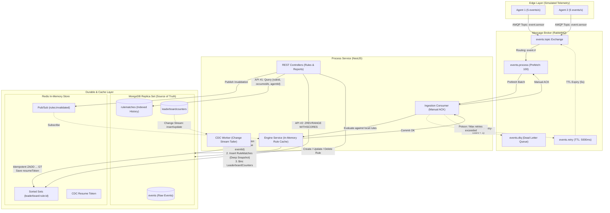

# Distributed Event-Driven Rule Engine & Processing System

[](https://nestjs.com/)
[](https://www.typescriptlang.org/)
[](https://www.docker.com/)
[](https://www.rabbitmq.com/)
[](https://www.mongodb.com/)
[](https://redis.io/)
[](http://localhost:3000/api/docs)

A production-grade, highly reliable, and horizontally scalable event-driven microservices system built with **NestJS**, **RabbitMQ**, **MongoDB Replica Set**, and **Redis**.

The system simulates high-velocity telemetry from distributed agent edge nodes, evaluates events against dynamic rules in-memory, guarantees **effectively-once** transactional processing, and projects high-performance analytics using **Change Data Capture (CDC)** and keyset cursor-paginated indexes.

---

## Table of Contents

- [Quickstart: Running the System](#1-quickstart-running-the-system)
- [Interactive API Documentation (Swagger)](#2-interactive-api-documentation-swagger)
- [Live Verification & API Endpoints](#3-live-verification--api-endpoints)
  - [1. Health Check](#1-health-check)
  - [2. Rule Management (CRUD)](#2-rule-management-crud)
  - [3. Time-Range Report (API #1)](#3-time-range-report-api-1)
  - [4. Real-Time Leaderboard (API #2)](#4-real-time-leaderboard-api-2)
- [Architecture & Design Decisions](#4-architecture--design-decisions)
  - [System Flow Diagram](#system-flow-diagram)
  - [1. Effectively-Once Ingestion & Atomic Transactions](#1-effectively-once-ingestion--atomic-transactions)
  - [2. Reliable RabbitMQ Topology & Dead-Letter Routing](#2-reliable-rabbitmq-topology--dead-letter-routing)
  - [3. High-Throughput In-Memory Rule Engine & Distributed Cache Invalidation](#3-high-throughput-in-memory-rule-engine--distributed-cache-invalidation)
  - [4. CQRS Read Model via Mongo Change Data Capture (CDC)](#4-cqrs-read-model-via-mongo-change-data-capture-cdc)
  - [5. Query Optimization & Keyset Cursor Pagination](#5-query-optimization--keyset-cursor-pagination)
- [Verification & Benchmarks](#5-verification--benchmarks)
- [Monorepo Directory Structure](#6-monorepo-directory-structure)

---

## 1. Quickstart: Running the System

The entire ecosystem is orchestrated via **Docker Compose** with self-healing health checks:

### Prerequisites
- Docker Engine `>= 24.0.0`
- Docker Compose `>= 2.20.0`

### Step 1: Boot the stack
```bash
docker-compose up --build -d
```

This single command provisions and starts 6 containers:
1. `agent_mongodb`: Single-node MongoDB Replica Set (`rs0`) for ACID transactions and Change Streams.
2. `agent_rabbitmq`: AMQP broker with topic exchange, delayed retry queues, and dead-letter queues.
3. `agent_redis`: High-speed memory store for leaderboards and distributed Pub/Sub cache invalidation.
4. `process_service`: NestJS ingestion, transactional engine, CDC worker, and public REST API (Port `3000`).
5. `agent_1`: Edge agent generating sensor telemetry at ~5 events/sec.
6. `agent_2`: Edge agent generating sensor telemetry at ~5 events/sec.

### Step 2: Verify container health
```bash
docker ps --format "table {{.Names}}\t{{.Status}}\t{{.Ports}}"
```

### Step 3: Stream processing logs in real-time
```bash
docker logs -f process_service
```

---

## 2. Interactive API Documentation (Swagger)

A full OpenAPI 3.0 specification with live testing capabilities is mounted directly on the Process Service:

👉 **[http://localhost:3000/api/docs](http://localhost:3000/api/docs)**

- **Raw OpenAPI JSON Spec:** `http://localhost:3000/api/docs-json`
- **RabbitMQ Admin Console:** `http://localhost:15672` (Username: `guest` | Password: `guest`)

---

## 3. Live Verification & API Endpoints

### 1. Health Check
Verifies connectivity and latency across MongoDB, Redis, and RabbitMQ simultaneously:
```bash
curl -s http://localhost:3000/health | jq .
```
```json
{
  "status": "ok",
  "info": {
    "mongodb": { "responseTime": 3, "status": "up" },
    "redis": { "status": "up" },
    "rabbitmq": { "status": "up" }
  }
}
```

---

### 2. Rule Management (CRUD)

#### Create a Rule
Registers a rule condition (supports operators: `GT`, `LT`, `EQ`). When created, it broadcasts an invalidation across all engine replicas via Redis Pub/Sub:
```bash
curl -X POST http://localhost:3000/rules \
  -H "Content-Type: application/json" \
  -d '{
    "name": "High Voltage Alert",
    "conditions": [
      { "field": "value", "operator": "GT", "value": 50 }
    ],
    "isActive": true
  }' | jq .
```
Response:
```json
{
  "_id": "6ac0102c240d4e5320f43ec5",
  "name": "High Voltage Alert",
  "conditions": [{ "field": "value", "operator": "GT", "value": 50 }],
  "isActive": true,
  "createdAt": "2026-10-02T20:12:28.679Z"
}
```

#### List Rules with Pagination
```bash
curl -s "http://localhost:3000/rules?limit=10&offset=0" | jq .
```

#### Update or Toggle a Rule
```bash
curl -X PUT http://localhost:3000/rules/6ac0102c240d4e5320f43ec5 \
  -H "Content-Type: application/json" \
  -d '{ "isActive": false }' | jq .
```

#### Delete a Rule
```bash
curl -X DELETE http://localhost:3000/rules/6ac0102c240d4e5320f43ec5 | jq .
```

---

### 3. Time-Range Report (API #1)
Retrieves all historical match occurrences for a given rule within a window of **up to 24 hours**, grouped by `agentId`. It uses **Keyset Cursor Pagination** over an optimal compound index:

```bash
# Query the past 1 hour with limit 5
START=$(date -u -v-1H +"%Y-%m-%dT%H:%M:%SZ" 2>/dev/null || date -u -d "1 hour ago" +"%Y-%m-%dT%H:%M:%SZ")
END=$(date -u +"%Y-%m-%dT%H:%M:%SZ")

curl -s "http://localhost:3000/reports/time-range/6ac0102c240d4e5320f43ec5?startTime=${START}&endTime=${END}&limit=5" | jq .
```
Response:
```json
{
  "data": {
    "agent-1": [
      "2026-10-02T20:13:41.467Z",
      "2026-10-02T20:13:42.882Z"
    ],
    "agent-2": [
      "2026-10-02T20:13:42.290Z",
      "2026-10-02T20:13:43.095Z"
    ]
  },
  "nextCursor": "MTc5MDk3MjAyNDkxNw=="
}
```

**Fetch the next page using `cursor`:**
```bash
curl -s "http://localhost:3000/reports/time-range/6ac0102c240d4e5320f43ec5?startTime=${START}&endTime=${END}&limit=5&cursor=MTc5MDk3MjAyNDkxNw==" | jq .
```

---

### 4. Real-Time Leaderboard (API #2)
Returns the all-time ranking of agents sorted descending by match count. This endpoint is served with sub-millisecond latency directly from **Redis Sorted Sets** populated asynchronously via MongoDB Change Streams:

```bash
curl -s http://localhost:3000/reports/leaderboard/6ac0102c240d4e5320f43ec5 | jq .
```
Response:
```json
[
  { "agentId": "agent-1", "count": 1867 },
  { "agentId": "agent-2", "count": 1836 }
]
```

---

## 4. Architecture & Design Decisions

### System Flow Diagram



---

### 1. Effectively-Once Ingestion & Atomic Transactions

In distributed event systems, network partitions and consumer crashes make message duplicates inevitable (at-least-once delivery). 

We achieve **effectively-once processing semantics** using MongoDB Multi-Document ACID Transactions paired with unique compound indexes:
1. Every event has an immutable `eventId` UUID assigned at edge generation.
2. The `events` collection enforces a **Unique Index** on `{ eventId: 1 }`.
3. Within a single transaction session:
   - The event is recorded into `events` (persisting all events, even zero matches).
   - If rules match, immutable audit records with deep-copied rule definitions (`ruleSnapshot`) are inserted into `rulematches`.
   - Counter tallies are atomically incremented via `$inc` in `leaderboardcounters`.
4. If a duplicate message is consumed (e.g., following a worker crash before ACK), MongoDB raises error `E11000` (Duplicate Key Error). The transaction is safely aborted, no duplicate side-effects occur, and the consumer cleanly ACKs the message.

---

### 2. Reliable RabbitMQ Topology & Dead-Letter Routing

To eliminate infinite retry poison-message storms:
- **Exchange:** `events.topic` (durable).
- **Processing Queue:** `events.process` bound to `event.#` with `prefetch = 100` for controlled backpressure.
- **Delayed Retry Queue:** `events.retry` configured with `messageTtl: 5000` and `deadLetterExchange: events.topic`.
- **Dead Letter Queue (DLQ):** `events.dlq` bound to `events.dlx`.
- **Bounded Retry Policy:**
  - Transient errors (e.g. temporary database locks, write conflicts) increment header `x-retry-count`. If `< 3`, the message is routed to the retry exchange for exponential backoff.
  - Poison pills (malformed JSON, schema violations) or messages exceeding 3 attempts are routed immediately to the DLQ, ensuring the processing pipe never stalls.

---

### 3. High-Throughput In-Memory Rule Engine & Distributed Cache Invalidation

Evaluating rules sequentially against database queries for every event is an anti-pattern that destroys throughput:
- The `EngineService` keeps all active rules in **local heap memory**.
- Incoming events are evaluated in microsecond-level CPU operations without I/O blocking.
- When an administrative user modifies, creates, or deletes a rule via the REST API:
  1. The change is committed to MongoDB.
  2. An invalidation message is broadcast via Redis Pub/Sub (`rules:invalidated`).
  3. All running engine instances instantly refresh their active rule cache.
- A **30-second interval fallback poll** ensures cache consistency even during temporary Redis disconnects.

---

### 4. CQRS Read Model via Mongo Change Data Capture (CDC)

Calculating global agent leaderboards with real-time `COUNT()` aggregations over millions of rows introduces extreme database contention. 

We decouple write transactions from high-frequency read queries through **CQRS & Eventual Consistency**:
1. Ingestion transactions atomically increment `LeaderboardCounters` in MongoDB (the authoritative Source of Truth).
2. The background `CdcService` tails the MongoDB **Change Stream** on `leaderboardcounters`.
3. For every change, it executes:
   ```redis
   ZADD leaderboard:rule:<ruleId> GT <count> <agentId>
   ```
   The `GT` (Greater Than) flag guarantees that older out-of-order CDC updates can **never decrement or corrupt** the score.
4. The latest Change Stream resume token is persisted to Redis (`cdc:resumeToken`). On cold boot or Redis cache flush, the service automatically initiates `rebuildFromMongo()` to repopulate the Redis Sorted Sets directly from MongoDB.

---

### 5. Query Optimization & Keyset Cursor Pagination

#### API #1: Time-Range Report
- Strict validation restricts queries to a **maximum window of 24 hours**.
- Backed by the compound candidate index:
  ```javascript
  { ruleId: 1, occurredAt: 1, agentId: 1 }
  ```
- Uses **Keyset Cursor-based Pagination** using base64-encoded `occurredAt` timestamps (`$gt: cursorTimestamp`). This avoids standard `skip/limit` performance degradation on deep pages and maintains constant $O(1)$ query latency regardless of page depth.

#### Execution Plan Benchmark (`explain("executionStats")`)
```json
{
  "stage": "LIMIT",
  "nReturned": 10,
  "executionTimeMillis": 0,
  "totalKeysExamined": 10,
  "totalDocsExamined": 10,
  "inputStage": {
    "stage": "IXSCAN",
    "indexName": "ruleId_1_occurredAt_1_agentId_1",
    "keysExamined": 10
  }
}
```
> **Benchmark Ratio:** `totalKeysExamined / totalDocsExamined = 1.0`. The index is utilized with 100% efficiency with zero unindexed table scans (`COLLSCAN`).

---

## 5. Verification & Benchmarks

### Unit Tests
Pure unit tests validating evaluator conditions (`GT`, `LT`, `EQ`), multiple matches, and boundary cases:
```bash
npm test
```

### Verification Scripts
To run an index analysis directly against the live MongoDB replica set:
```bash
docker exec -it agent_mongodb mongosh event-system --eval "
  db.rulematches.find({ ruleId: ObjectId('6ac0102c240d4e5320f43ec5') })
    .sort({ occurredAt: 1 })
    .limit(10)
    .explain('executionStats').executionStats
"
```

---

## 6. Monorepo Directory Structure

```text
├── apps/
│   ├── agent-service/               # Telemetry generator microservice
│   │   ├── src/
│   │   │   ├── generator/           # Faker event generator (~5 evt/s)
│   │   │   └── publisher/           # Resilient RabbitMQ AMQP publisher
│   │   └── Dockerfile
│   │
│   └── process-service/             # Core processing engine & API
│       ├── src/
│       │   ├── core/logging/        # Pino structured JSON logging
│       │   ├── infrastructure/
│       │   │   ├── cache/           # Redis client & Pub/Sub providers
│       │   │   ├── database/        # Mongoose schemas & compound indexes
│       │   │   └── messaging/       # AMQP topology, retry & DLQ config
│       │   ├── modules/
│       │   │   ├── cdc/             # Change Data Capture worker
│       │   │   ├── engine/          # Transactional executor & rule evaluator
│       │   │   ├── health/          # Terminus multi-service health checks
│       │   │   ├── ingestion/       # AMQP consumer with manual ACK & retries
│       │   │   ├── reporting/       # Keyset cursor reporting & Redis leaderboard
│       │   │   └── rules/           # Rule CRUD with Pub/Sub invalidation
│       │   └── main.ts              # Bootstrap with Swagger OpenAPI mounting
│       └── Dockerfile
│
├── ARCHITECTURE_FLOW.md             # In-depth architectural specification & flows
├── docker-compose.yml               # Multi-container cluster orchestration
├── package.json                     # Monorepo dependencies & scripts
└── README.md                        # Documentation & setup guide
```

---

## License
MIT
